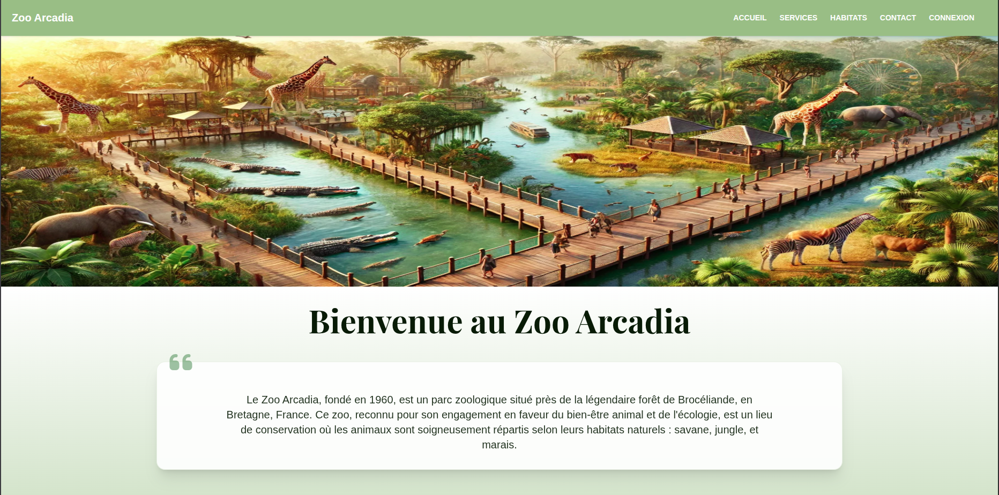

# 🦁 Zoo Arcadia - Application de Gestion de Parc Zoologique



## 📋 Présentation

Zoo Arcadia est une application web moderne développée avec Angular 18, conçue pour optimiser la gestion quotidienne d'un parc zoologique. Cette plateforme offre une interface intuitive et responsive permettant aux différents acteurs du zoo (vétérinaires, employés et administrateurs) de gérer efficacement leurs tâches respectives.

## ✨ Fonctionnalités

- **Gestion des animaux** : Suivi des informations, santé et alimentation des animaux
- **Gestion des habitats** : Maintenance et organisation des espaces de vie des animaux
- **Tableau de bord administratif** : Interface complète pour les administrateurs
- **Services du zoo** : Gestion des services proposés aux visiteurs
- **Interface responsive** : Accessible sur tous les appareils

## 🛠️ Prérequis

- Node.js (version 18.x ou supérieure)
- npm (version 9.x ou supérieure)
- Angular CLI (version 18.x)

## 🚀 Installation et démarrage

### 1. Cloner le projet

```bash 
git clone https://github.com/djoudj-dev/arcadia-zoo-app-front.git
cd arcadia-zoo-app-front
```

### 2. Installer les dépendances

```bash
npm install
```

### 3. Lancer le serveur de développement

```bash
ng serve
```

L'application sera accessible à l'adresse : [http://localhost:4200](http://localhost:4200)

## 🔄 Configuration du backend

Pour connecter l'application au backend, vous devez configurer les variables d'environnement dans le fichier :

```
src/environments/environment.development.ts
```

Exemple de configuration :

```typescript
export const environment = {
  production: false,
  apiUrl: 'http://localhost:3000/api'
};
```

## 🏗️ Structure du projet

```
src/
├── app/
│   ├── core/          # Services et composants essentiels
│   ├── features/      # Modules fonctionnels
│   │   ├── animal/    # Gestion des animaux
│   │   ├── contact/   # Formulaires de contact
│   │   ├── dashboard/ # Tableau de bord administratif
│   │   ├── habitats/  # Gestion des habitats
│   │   ├── home/      # Page d'accueil
│   │   └── zoo-services/ # Services du zoo
│   └── shared/        # Composants et services partagés
├── assets/            # Ressources statiques
└── environments/      # Configuration des environnements
```

## 🎯 Technologies Utilisées

- **Angular 18** : Framework frontend
- **Tailwind CSS** : Framework CSS utilitaire
- **TypeScript** : Langage de programmation
- **RxJS** : Bibliothèque pour la programmation réactive

## 🤝 Contribution

Les contributions sont les bienvenues ! N'hésitez pas à ouvrir une issue ou à soumettre une pull request.

## 📝 Licence

Ce projet est un projet de formation [STUDI](https://www.studi.com/fr).
